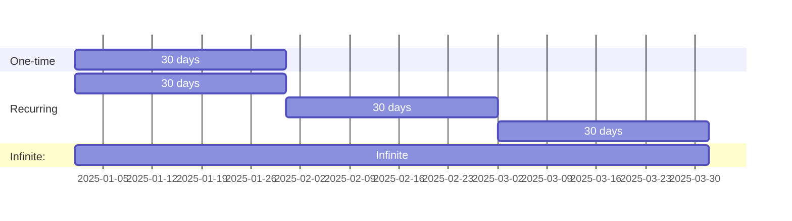
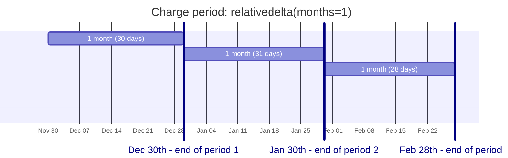

# django_subscriptions_rt: subscriptions and payments for your Django app
&nbsp;[](https://github.com/reef-technologies/django-subscriptions-rt/actions?query=workflow%3A%22Continuous+Integration%22)&nbsp;[](https://pypi.python.org/pypi/django_subscriptions_rt)&nbsp;[](https://pypi.python.org/pypi/django_subscriptions_rt)&nbsp;[](https://pypi.python.org/pypi/django_subscriptions_rt)

## Supported versions

See [ci.yml](.github/workflows/ci.yml) for matrix of supported Python and Django versions.

> [!IMPORTANT]
> Only Postgres database is supported (due to PG_ADVISORY_LOCK requirement).

## Features

* Basic Recurring. Subscription Plans are defined for the same products/services on a fixed, recurring charge.
* Good-Better-Best. Subscription Plans are defined with products or services sold in feature tiers, with escalating features and pricing for each tier.
* Per-Seat. Subscription Plans are defined with products or services sold in user/license quantity tiers, with volume pricing for each tier of user/license quantities.
* Metered Billing. Subscription Plans are defined where customers are billed in arrears based on usage of your product/service as calculated by your platform.

## Configuration

```python
# settings.py
INSTALLED_APPS = [
   # ...,
   "subscriptions.v0.apps.AppConfig",
   "pgactivity",
   "pglock",
]
```

> [!IMPORTANT]
> This package uses [ApiVer](#versioning), make sure to import `subscriptions.vX` for guaranteed backward compatibility.

For possible settings and their defaults see [defaults.py](src/subscriptions/_internal/defaults.py).

### Cache

Cache is required for fast resource calculations.

```python
settings.CACHES['subscriptions'] = {
   'BACKEND': 'django.core.cache.backends.locmem.LocMemCache',
   'LOCATION': 'subscriptions',
}
```

## Usage

A `Plan` is some option which gives a user some benefits.

A `Subscription` is a user's belonging to a specific `Plan` for a defined period of time.



```python
# Create different plans and "attach" them to some user

from dateutil.relativedelta import relativedelta
from django.contrib.auth.models import User

from subscriptions.v0.models import Plan, Subscription


one_time_plan = Plan.objects.create(
   codename="one-time",
   name="One-time plan",
   max_duration=relativedelta(months=1),
)

recurring_plan = Plan.objects.create(
   codename="recurring",
   name="Recurring plan",
   charge_period=relativedelta(months=1),
)

infinite_plan = Plan.objects.create(
   codename="infinite",
   name="Infinite plan",
)

user = User.objects.create(username="test", email="test@localhost")
for plan in [one_time_plan, recurring_plan, infinite_plan]:
   Subscription.objects.create(user=user, plan=plan)
```

### Plan immutability

Plan is a groundtruth for all calculations, meaning that once a plan has subscriptions attached, its core attributes (`charge_amount` and `charge_period`) should not change. Trying to change essential plan attributes while having attached subscriptions [will raise a `ValidationError`](tests/unit/internal/test_models.py#ref:plan-immutability).

### Recurring subscriptions

Recurring subscriptions are those that live for a limited period of time and require recharging when approaching its end.

`Plan.charge_period` defines how often subscription charges will happen. It expects [a `relativedelta` object](https://dateutil.readthedocs.io/en/stable/relativedelta.html), so you can specify complex time periods easily - for example, if starting a subscription on _Nov 30st_ with `charge_period=relativedelta(months=1)`, next charge dates will be _Dec 30st_, _Jan 30st_ etc, so real charge period will be not exactly 30 days - [see an example in tests](tests/unit/internal/test_subscription.py#ref:charge-period-relativedelta).



### Charges

```
|--------subscription-------------------------------------------->
start             (subscription duration)                end or inf

|-----------------------------|---------------------------|------>
charge   (charge period)    charge                      charge

|------------------------------x
quota   (quota lifetime)       quota burned

(quota recharge period) |------------------------------x

(quota recharge period) (quota recharge period) |----------------->
```

### Money

`NO_MONEY`

### Max duration

`INFINITY`

### Subscripiton qiantity

### Charge period

### Charge amount

### Tiers

### Plan immutability

### Auto_prolong

### Tracking changes

[django-model-utils](https://django-model-utils.readthedocs.io/en/latest/utilities.html) package is used to track changes in essential models, such as `Subscription`, `SubscriptionPayment`, and `SubscriptionPaymentRefund`. This allows to track changes in subscription status / dates, payment status, and other fields.

This is an example of how to do some processing when subscription payment status changes:

```python
@receiver(post_save, sender=SubscriptionPayment)
def handler(sender, instance: SubscriptionPayment, **kwargs):
   if instance.tracker.has_changed("status"):
      old_status = instance.tracker.previous("status")
      new_status = instance.status
      print(f'Payment status changed from {old_status} to {new_status}')
```

### Validators

### Grace period

If a renewal payment is declined, Google will ask the user to fix the payment issue and periodically retry the renewal charge. By default, this recovery period consists of a grace period, followed by an account hold period. You can specify the length of the grace period, during which the user retains subscription entitlement.

### Account hold

After any grace period has ended with the payment issue unresolved, the subscription can enter an account hold period. You can specify the length of account hold, during which the user should not have subscription entitlement. If the account hold period ends with the payment issue unresolved, the subscription is automatically expired.

### Pausing subscriptions

- subscription.unused_time

### Discounts

### Plan changes

Over time, you can create and modify many subscriptions, base plans, and offers. While some might become obsolete, historical data can be useful for analytics and reporting purposes. Likewise, you might want to create alternatives for experimentation or switch from one offer to another depending on seasons or other factors. The new subscription system supports these use cases with subscription object states. To ensure information is always available for reporting and analysis purposes, you can't delete subscriptions, base plans, and offers, or reuse their IDs.

### Default plan

Use `pip install django-subscriptions-rt[default_plan]` to install constance as dependency.

Setup default plan like this:

```python
INSTALLED_APPS = [
   ...
   'constance',
   'constance.backends.database',
]

CONSTANCE_BACKEND = 'constance.backends.database.DatabaseBackend'
CONSTANCE_CONFIG = {
   'SUBSCRIPTIONS_DEFAULT_PLAN_ID': (0, 'Default plan ID', int),
}
```

Changing default plan value will adjust default subscriptions automatically.

### Trial period

It is possible to postpone user's first payment by some timedelta. When creating a subscription, set `charge_offset`, which will shift all charge dates by this offset:

```python
from dateutil.relativedelta import relativedelta
from django.utils.timezone import now

now_ = now()
offset = relativedelta(days=7)
subscription = Subscription.objects.create(
   # ...
   start=now_,
   charge_offset=offset,
)

assert next(subscription.iter_charge_dates()) == now_ + offset
```

There is a handy setting `SUBSCRIPTIONS_TRIAL_PERIOD`:

```python
from dateutil.relativedelta import relativedelta

SUBSCRIPTIONS_TRIAL_PERIOD = relativedelta(days=7)
```

If
* subscription is created via `POST` request to `SubscriptionSelectView` (which by default is at path `/subscribe/`),
* selected plan's `charge_amount` is non-zero,
* selected plan is recurring,
* user hasn't completed ANY payments (even zero ones),
* user never had any recurring subscriptions,

then charge amount will become zero, thus user only enters CC info without paying anything. The set of rules mentioned above may be changed by redefining `get_trial_period` method.

> Remember that "external" providers may not respect this setting at all.

Internally, trial period works like this:

1) User asks API to create new subscription
2) If situation is eligible for trial period, a new zero-amount `SubscriptionPayment` is requested, as well as corresponding `Subscription` is created with zero duration:

```
------[=======(Payment, cost=0)=======]-------->
                                      ^- trial period end
------[]--------------------------------------->
      ^--- Subscription with charge_offset = trial_period
```

3) Users enters CC details for the payment -> it gets confirmed; when the payment is confirmed, its subscription is extended till the end of trial period:

```
------[=======(Payment, cost=0)=======]-------->
                                      ^- trial period end
------[===Subscription================]-------->
                                       ^--- Here real price will be charged
```

### Middleware

It is costy - calculates resources for each authenticated user's request! May be handy in html templates, but better not to use it too much.

## Payment providers

There is a clear distinction between "self-hosted" vs "external" subscription solutions. "Self-hosted" means that everything (plans, upgrade/downgrade rules, charging schedules etc) is set up on backend side, and payment provider is only used to store CC information and charge money when  backend asks to do so. However, some payment providers don't allow that, thus it is called "external" - everything is configured in provider dashboard, and it's a provider who does periodic charges etc. The only thing backend does - receives webhook (or periodically fetches information itself, or both altogether), and updates subscriptions (changes timespan, pauses, resumes etc).

"Self-hosted" provider means that backend is the command center, and it is capable of implementing custom logic of any complexity. The drawback here is that backend is responsible for periodic checks and charges, which requires monitoring and extra setup.

"External" providers are limited to whatever logic is provided by third-party developers. However, it is much easier to setup and maintain it.

### Paddle

Uses [paddle.com](https://paddle.com) as payment provider.

This implementation is self-hosted. Paddle does not provide a lot of control over charges, however it has an undocumented opportunity to create a zero-cost subscription with infinite charge period. After this subscription is created, user can be charged by backend at any moment with any amount.

### App store

Workflow from the mobile application perspective:

1) App fetches data from backend's `/plans/` endpoint. Each plan will have metadata entry `apple_in_app`
   -> `string`, where `string` represents an
   Apple [Product identifier](https://developer.apple.com/documentation/storekit/product/3851116-products)
2) When user performs a purchase,
   app [fetches the receipt data](https://developer.apple.com/documentation/storekit/in-app_purchase/original_api_for_in-app_purchase/validating_receipts_with_the_app_store)
3) Receipt is sent to backend using `POST /webhook/apple_in_app/ {"transaction_receipt": "<base64 encoded receipt>"}`.
   This request needs to be authenticated on behalf of the user that this operation is performed for
4) If everything is fine, new `SubscriptionPayment` and `Subscription` will be created and returned to the app. The json
   returned to the app is the same as when querying `/payments/<uid>/` endpoint
5) In case of an error, a retry should be performed with an exponentially increased timeout and after each application
   restart. Utmost care should be taken when handling the receipt. It should be stored on the device until the server
   accepts the operation. Failure to comply will result in client dissatisfaction and a potential refund

#### WARNING

Server is unable to reject any payment coming from Apple. Receipt that we receive means that the user has already paid.
Thus, it is in the best interest of the frontend application to prohibit user that is already on a paid plan from
purchasing another one

Workflow from the backend perspective – handling client operation:

1) Server side part of
   the [validation](https://developer.apple.com/documentation/storekit/in-app_purchase/original_api_for_in-app_purchase/validating_receipts_with_the_app_store)
   process is performed
2) User provided from the authentication is the one having a `Subscription` and `SubscriptionPayment` created for
3) [Transaction id](https://developer.apple.com/documentation/appstorereceipts/responsebody/receipt/in_app) for this operation is kept with `SubscriptionPayment`

Workflow from the backend perspective – handling renewals:

This assumes that the `/webhook/apple_in_app/` endpoint is assigned
as [notifications service](https://developer.apple.com/documentation/appstoreservernotifications/enabling_app_store_server_notifications)
Currently, only `version 2` of the notifications is supported.

1) Whenever a notification is received from Apple, we discard anything that's not a renewal operation. It is assumed that we, ourselves, can handle expiration, and other events are to be handled in the future
2) Renewal operation contains original transaction id (the first transaction that initiated the whole subscription) – this is used (in turns) to fetch user for which this operation is performed
3) New `SubscriptionPayment` is created, using expiration date provided in the notification

### Google in-app purchase

Automatic sync of plans between Google Play and the backend (BE) is not implemented yet, so operator should keep both in sync manually:

* Plans on BE and Subscriptions on Google <- how to sync
* Changes made on BE won't affect Google Play purchases, so don't touch it. All information is _pulled_ from Google Play to BE automatically, and BE admin should only be used to read data.
* Subscription pause is not supported by BE and should be disabled in Google Play.
* Grace period is not supported by BE and should be disabled in Google Play.

Workflow:

([inspired by](https://developer.android.com/google/play/billing/security#verify))

1) Backend pushes actual plans to Google Play using [Subscriptions and In-app Purchases API⁠](https://developers.google.com/android-publisher#subscriptions).
2) Mobile app fetches data from backend's `/plans/` endpoint. Each plan will have metadata entry `google_in_app` -> `dict`, where `dict` is a [Subscription](https://developers.google.com/android-publisher/api-ref/rest/v3/monetization.subscriptions).
3) User purchases desired product (is it possible to associate custom metadata with purchase on google servers?) and mobile app receives "purchase token" from google play. This token is sent to backend: `POST /webhook/google_in_app/ {'purchase_token': <value>}`. App should not forget to send user authentication info along with the request. This is an essential part of connecting subscription to particular user, so this POST action should have retry logic in case of network error.
4) Backend fetches data from [Purchases.subscriptionsv2:get](https://developers.google.com/android-publisher/api-ref/purchases/subscriptionsv2) and verifies that the purchase is legit.
5) If everything is fine, new `SubscriptionPayment` and `Subscription` are created and returned to the app. The json returned to the app is the same as when querying `/payments/<uid>/` endpoint.
6) App can now use the credits included in the plan.
7) Any other subscription changes are handled by backend automatically by interacting with google APIs.

[How to test](https://developer.android.com/google/play/billing/test)

## Reports

This app comes with basic reporting functionality, including (but not limited to) completed and incompleted payments during selected period of time, as well as estimated recurring charges' dates and amounts in past and future.

Below is an example how to use reporting functionality. Please pay attention that arguments are converted to a period `[since, until)` (`until` is not included).

```python
from django.utils.timezone import now
from datetime import timedelta
from subscriptions.v0 import SubscriptionsReport, TransactionsReport


subscriptions = SubscriptionsReport(
   since=now()-timedelta(days=30),
   until=now(),
)

print('New subscriptions count:', subscriptions.get_new_count())
print('New subscriptions dates:', subscriptions.get_new_datetimes())

print('Ended subscriptions count:', subscriptions.get_ended_count())
print('Ended subscriptions dates:', subscriptions.get_ended_datetimes())
print('Ended subscriptions ages:', subscriptions.get_ended_or_ending_ages())

print('Active subscriptions count:', subscriptions.get_active_count())
print('Active users count:', subscriptions.get_active_users_count())
print('Active subscriptions ages:', subscriptions.get_active_ages())
print('Active plans & quantities:', subscriptions.get_active_plans_and_quantities())
print('Active plans -> quantity total:', subscriptions.get_active_plans_total())

transactions = TransactionsReport(
   provider_codename="paddle",
   since=now()-timedelta(days=30),
   until=now(),
)

print('Status -> num payments:', transactions.get_payments_count_by_status())

print('Completed payments amounts:', transactions.get_completed_payments_amounts())
print('Completed payments average:', transactions.get_completed_payments_average())
print('Completed payments total:', transactions.get_completed_payments_total())

print('Inompleted payments amounts:', transactions.get_incompleted_payments_amounts())
print('Incompleted payments total:', transactions.get_incompleted_payments_total())

print('Refunds count:', transactions.get_refunds_count())
print('Refunds amounts:', transactions.get_refunds_amounts())
print('Refunds average:', transactions.get_refunds_average())
print('Refunds total:', transactions.get_refunds_total())

print('Datetime -> estimated charge amount:', transactions.get_estimated_recurring_charge_amounts_by_time())
print('Estimated charge total:', transactions.get_estimated_recurring_charge_total())
```

Usually it is handy to generate reports for some periods e.g. weeks, months, or years. There is a class method which will auto-generate subsequent reports with desired frequency:

```python
from subscriptions.v0 import SubscriptionsReport, TransactionsReport, MONTHLY, DAILY

for report in SubscriptionsReport.iter_periods(
   frequency=MONTHLY,
   since=now()-timedelta(days=90),
   until=now(),
):
   print(f'New subscriptions count for {report.since}-{report.until}: {report.get_new_count()}')

for report in TransactionsReport.iter_periods(
   frequency=DAILY,
   since=now()-timedelta(days=30),
   until=now(),
   provider_codename="paddle",
):
   print(f'Completed payments amount for {report.since}-{report.until}: {report.get_completed_payments_total()}')
```

Reports may be extended by subclassing the above classes.


## Versioning

This package uses [Semantic Versioning](https://semver.org/spec/v2.0.0.html).
TL;DR you are safe to use [compatible release version specifier](https://packaging.python.org/en/latest/specifications/version-specifiers/#compatible-release) `~=MAJOR.MINOR` in your `pyproject.toml` or `requirements.txt`.

Additionally, this package uses [ApiVer](https://www.youtube.com/watch?v=FgcoAKchPjk) to further reduce the risk of breaking changes.
This means, the public API of this package is explicitly versioned, e.g. `subscriptions.v0`, and will not change in a backwards-incompatible way even when `subscriptions.v1` is released.

Internal packages, i.e. prefixed by `subscriptions._` do not share these guarantees and may change in a backwards-incompatible way at any time even in patch releases.


## Development

### Pre-requisites

- [uv](https://docs.astral.sh/uv/)
- [nox](https://nox.thea.codes/en/stable/) - install globally with `uv tool install --with pyyaml nox`
- [docker](https://www.docker.com/) and [docker compose](https://docs.docker.com/compose/)

To install required and optional dependencies into `.venv`, run:
```bash
uv sync --all-groups
```

### Running tests

To fix formatting issues before committing, run:
```bash
uvx nox -s format
```

To run tests:
```bash
sudo docker compose -f tests/docker-compose.yml up  # start postgres database in docker

uvx nox -s lint
uvx nox -s test
```

### Release process

```bash
uvx nox -s make_release -- X.Y.Z
```
where `X.Y.Z` is the version you're releasing and follow the printed instructions.
